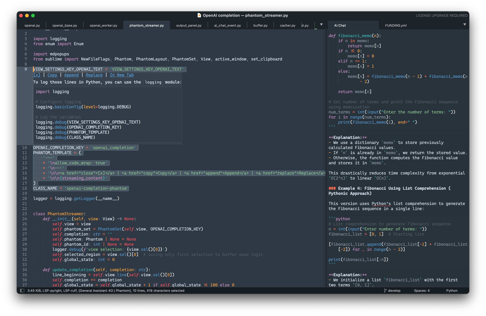
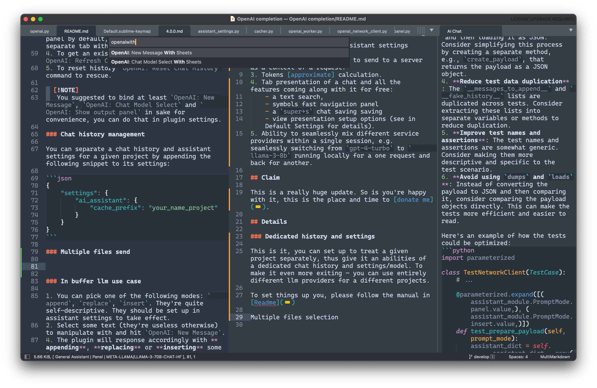

[![Star on GitHub][img-stars]][stars] ![Package Control][img-downloads]

# OpenAI Sublime Text Plugin
## tldr;

Cursor level of AI assistance for Sublime Text. I mean it.

Works with all OpenAI'ish API: [llama.cpp](https://github.com/ggerganov/llama.cpp) server, [ollama](https://ollama.com) or whatever third party LLM hosting.



## Features

- Code manipulation (append, insert and edit) selected code with OpenAI models.
- **Phantoms** Get non-disruptive inline right in view answers from the model.
- **Chat mode** powered by whatever model you'd like.
- **gpt-o1 support**.
- **[llama.cpp](https://github.com/ggerganov/llama.cpp)**'s server, **[Ollama](https://ollama.com)** and all the rest OpenAI'ish API compatible.
- **Dedicated chats histories** and assistant settings for a projects.
- **Ability to send whole files** or their parts as a context expanding.
- Markdown syntax with code languages syntax highlight (Chat mode only).
- Server Side Streaming (SSE) (i.e. you don't have to wait for ages till GPT-4 print out something).
- Status bar various info: model name, mode, sent/received tokens.
- Proxy support.

### ChatGPT completion demo

https://github.com/yaroslavyaroslav/OpenAI-sublime-text/assets/16612247/37b98cc2-e9cd-46a6-ac5d-03845313096b

> video sped up to 1.7x

---

https://github.com/yaroslavyaroslav/OpenAI-sublime-text/assets/16612247/69f609f3-336d-48e8-a574-3cb7fda5822c

> video sped up to 1.7x

## Requirements

- Sublime Text 4
- **llama.cpp**, **ollama** installed _OR_
- Remote llm service provider API key, e.g. [OpenAI](https://platform.openai.com)

## Installation

1. Install the Sublime Text [Package Control](https://packagecontrol.io/installation) plugin if you haven't done this before.
2. Open the command palette and type `Package Control: Install Package`.
3. Type `OpenAI` and press `Enter`.

## Usage

### AI Assistance use case

ChatGPT mode works the following way:

0. Select some text or even the whole tabs to include them in request
1. Run either `OpenAI: Chat Model Select` or `OpenAI: Chat Model Select With Tabs` commands.
2. Input a request in input window if any.
3. The model will print a response in output panel by default, but you can switch that to a separate tab with `OpenAI: Open in Tab`.
4. To get an existing chat in a new window run `OpenAI: Refresh Chat`.
5. To reset history `OpenAI: Reset Chat History` command to rescue.

> [!NOTE]
>  You suggested to bind at least `OpenAI: New Message`, `OpenAI: Chat Model Select` and `OpenAI: Show output panel` in sake for convenience, you can do that in plugin settings.

### Chat history management

You can separate a chat history and assistant settings for a given project by appending the following snippet to its settings:

```json
{
    "settings": {
        "ai_assistant": {
            "cache_prefix": "your_project_name"
        }
    }
}
```

### Additional request context management

You can add a few things to your request:
- multi-line selection within a single file
- multiple files within a single View Group

To perform the former just select something within an active view and initiate the request this way without switching to another tab, selection would be added to a request as a preceding message (each selection chunk would be split by a new line).

To send the whole file(s) in advance to request you should `super+button1` on them to make all tabs of them to become visible in a **single view group** and then run `[New Message|Chat Model] with Sheets` command as shown on the screen below. Pay attention, that in given example only `README.md` and `4.0.0.md` will be sent to a server, but not a content of the `AI chat`.



> [!NOTE]
> It's also doesn't matter whether the file persists on a disc or it's just a virtual buffer with a text in it, if they're selected, their content will be send either way.

### Image handling

Image handle can be called by `OpenAI: Handle Image` command.

It expects an absolute path to image to be selected in a buffer or stored in clipboard on the command call (smth like `/Users/username/Documents/Project/image.png`). In addition command can be passed by input panel to proceed the image with special treatment. `png` and `jpg` images are only supported.

> [!NOTE]
> Currently plugin expects the link or the list of links separated by a new line to be selected in buffer or stored in clipboard **only**.

### In-buffer llm use case

#### Phantom use case

Phantom is the overlay UI placed inline in the editor view (see the picture below). It doesn't affects content of the view.

1. You can set `"prompt_mode": "phantom"` for AI assistant in its settings.
2. [optional] Select some text to pass in context in to manipulate with.
3. Hit `OpenAI: New Message` or `OpenAI: Chat Model Select` and ask whatever you'd like in popup input pane.
4. Phantom will appear below the cursor position or the beginning of the selection while the streaming LLM answer occurs.
5. You can apply actions to the llm prompt, they're quite self descriptive and follows behavior deprecated in buffer commands.
6. You can hit `ctrl+c` to stop prompting same as with in `panel` mode.


> [!IMPORTANT]
>  Yet this is a standalone mode, i.e. an existing chat history won't be sent to a server on a run.

> [!NOTE]
> A more detailed manual, including various assistant configuration examples, can be found within the plugin settings.

> [!WARNING]
> The following in buffer commands are deprecated and will be removed in 5.0 release.
> 1. [DEPRECATED] You can pick one of the following modes: `append`, `replace`, `insert`. They're quite self-descriptive. They should be set up in assistant settings to take effect.
> 2. [DEPRECATED] Select some text (they're useless otherwise) to manipulate with and hit `OpenAI: New Message`.
> 4. [DEPRECATED] The plugin will response accordingly with **appending**, **replacing** or **inserting** some text.

### Other features

### Open Source models support (llama.cpp, ollama)

1. Replace `"url"` setting of a given model to point to whatever host you're server running on (e.g.`"http://localhost:8080"`).
2. ~~[Optional] Provide a `"token"` if your provider required one.~~ **Temporarily mandatory, see warning below.**
3. Tweak `"chat_model"` to a model of your choice and you're set.

> [!WARNING]
> Due to a known issue, a token value of 10 or more characters is currently required even for unsecured servers. [More details here.](#workaround-for-64)

> [!NOTE]
> You can set both `url` and `token` either global or on per assistant instance basis, thus being capable to freely switching between closed source and open sourced models within a single session.

## Settings

The OpenAI Completion plugin has a settings file where you can set your OpenAI API key. This is required for the most of providers to work. To set your API key, open the settings within `Preferences` -> `Package Settings` -> `OpenAI` -> `Settings` and paste your API key in the token property, as follows:

```JSON
{
    "token": "sk-your-token",
}
```

> [!WARNING]
> Due to a known issue, a token value of 10 or more characters is currently required even for unsecured servers. [More details here.](#workaround-for-64)

### Advertisement disabling

To disable advertisement you have to add `"advertisement": false` line into an assistant setting where you wish it to be disabled.

## Key bindings

You can bind keys for a given plugin command in `Preferences` -> `Package Settings` -> `OpenAI` -> `Key Bindings`. For example you can bind "New Message" including active tabs as context command like this:

```javascript
{
    "keys": [ "super+k", "super+'" ],
    "command": "openai", // or "openai_panel"
    "args": { "files_included": true }
},
```

### [Multi]Markdown syntax with syntax highlight support

It just works.

> [!IMPORTANT]
> It's highly recommended to install the [`MultimarkdownEditing`](https://sublimetext-markdown.github.io/MarkdownEditing/) package to apply broader set of languages with syntax highlighting.

### Proxy support

You can setup it up by overriding the proxy property in the `OpenAI completion` settings like follow:

```javascript
"proxy": {
    "address": "127.0.0.1", // required
    "port": 9898, // required
    "username": "account",
    "password": "sOmEpAsSwOrD"
}
```

## Known bugs

### Workaround for [#64](https://github.com/yaroslavyaroslav/OpenAI-sublime-text/issues/64)

> [!CAUTION]
> There is currently a known issue which will trigger the following error even when connecting to an unsecured server.
>
> **"No API token provided, you have to set the OpenAI token into the settings to make things work."**

It is highly recommended to enable authentication in most cases, but especially when self-hosting models on your local system this can be inconvenient.

> [!TIP]
> Use the following workaround to avoid this error until a permanent solution can be released.
>
> **Simply ensure your assistant configuration defines a `"token",` value longer than 10 characters. It can be anything, since the server doesn't care, but must be present to prevent a validation error.**

#### Sample config

```javascript
{
    "url": "http://localhost:1234", // Url to your unsecured server
    "token": "xxxxxxxxxx", // Token can be anything so long as it is at least 10 characters long
    "assistants": [
        {
            // Inherits token from top-level, no error
            "name": "Code assistant",
            "prompt_mode": "panel",
            "chat_model": "codestral-22b-v0.1",
            "assistant_role": "You are a software developer, you develop software programs and applications using programming languages and development tools.",
            "temperature": 1,
            "max_tokens": 2048,
        },
        {
            // Overrides top-level token incorrectly, will get error
            "name": "Lazy Assistant",
            "token": "",
            "prompt_mode": "phantom",
            "chat_model": "llama-3-8b-instruct-32k-v0.1",
            "assistant_role": "You are very unhelpful.",
            "max_tokens": 4000,
        },
        {
            // Overrides top-level token correctly, no error
            "name": "General Assistant",
            "token": "abcdefghijklmn",
            "prompt_mode": "phantom",
            "chat_model": "llama-3-8b-instruct-32k-v0.1",
            "assistant_role": "You are very helpful.",
            "max_tokens": 4000,
        },
    ]
}
```

## Disclaimers

> [!WARNING]
> All selected code will be sent to the OpenAI servers (if not using custom API provider) for processing, so make sure you have all necessary permissions to do so.

> [!NOTE]
> This one was initially written at 80% by a GPT3.5 back then. I was there mostly for debugging purposes, rather than digging in into ST API. This is a pure magic, I swear!

[stars]: https://github.com/yaroslavyaroslav/OpenAI-sublime-text/stargazers
[img-stars]: static/media/star-on-github.svg
[downloads]: https://packagecontrol.io/packages/OpenAI%20completion
[img-downloads]: https://img.shields.io/packagecontrol/dt/OpenAI%2520completion.svg
